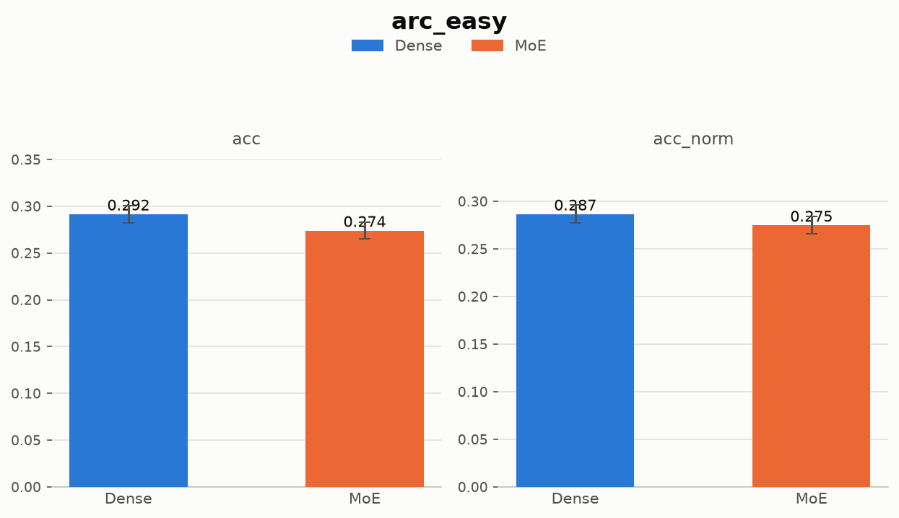
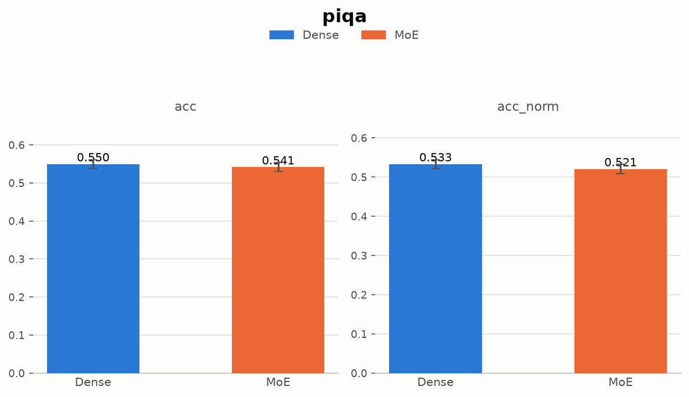
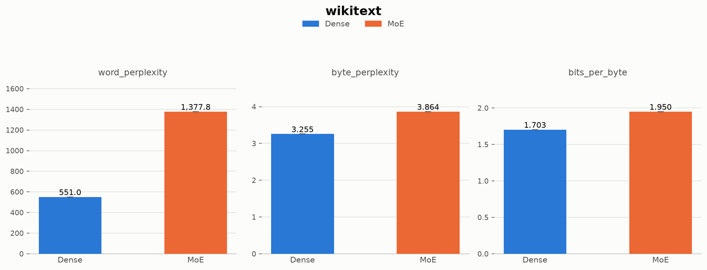
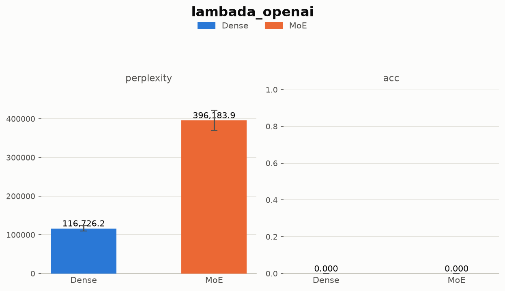
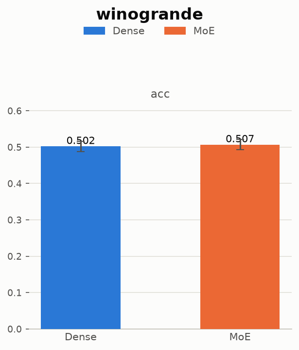
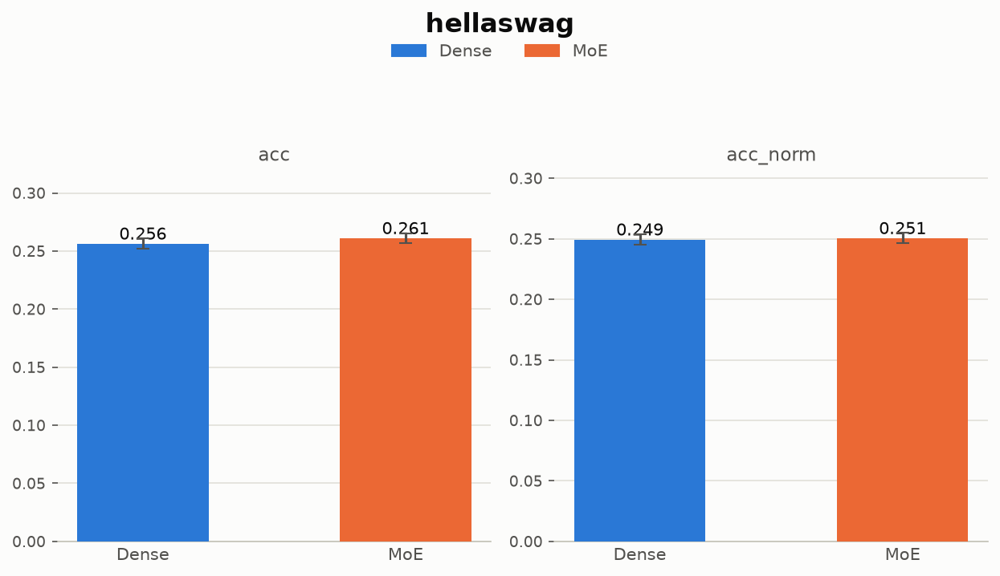
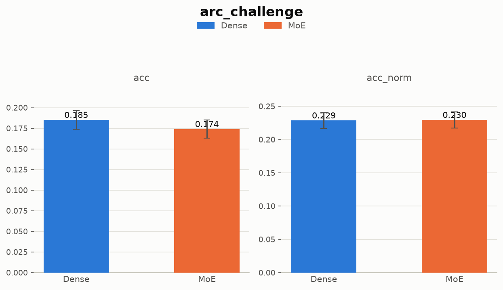
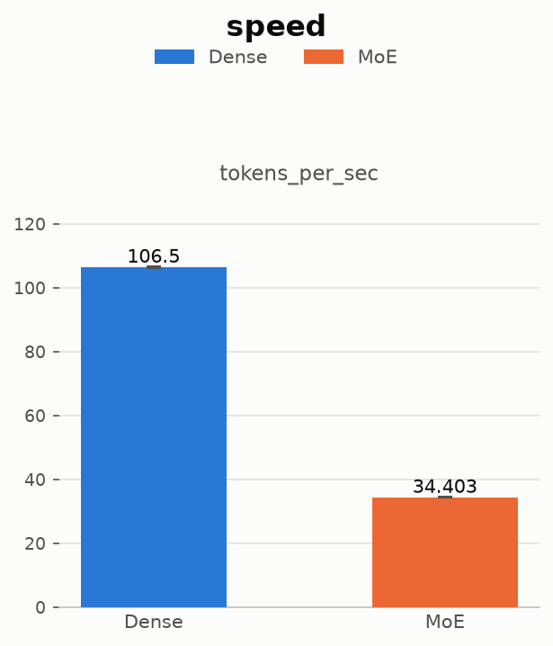

# MoE-Study

A from-scratch comparison of a **Dense** decoder-only transformer against a **Mixture-of-Experts (MoE)**
variant of the identical architecture.

Same attention. Same layer count. Same embedding size. Same data, hyperparameters, and compute budget —
so the only variable is whether the feed-forward block is dense or a sparse routed set of experts.


**Both models live in one Hugging Face repo:**
[**OliverSundaram/MoE-Study**](https://huggingface.co/OliverSundaram/MoE-Study) —
`dense/` and `moe/` subfolders, one shared tokenizer.

---

## Table of contents

- [TL;DR](#tldr)
- [Motivation](#motivation)
- [Repo structure](#repo-structure)
- [Dataset](#dataset)
- [Architecture](#architecture)
- [Training](#training)
- [Challenges & mistakes](#challenges--mistakes)
- [Evaluation](#evaluation)
- [Results](#results)
- [Key findings](#key-findings)
- [Models](#models)
- [Reproducing this project](#reproducing-this-project)
- [Environment](#environment)
- [Limitations](#limitations)
- [Suggestions](#Suggestions)
- [Acknowledgments & citations](#acknowledgments--citations)
- [License](#license)

---

## TL;DR

> At matched active-parameter count (**~150M**), matched training budget (**1 epoch, ~40.7M tokens**), and
> matched hardware, **Dense beat MoE on almost every benchmark** — and ran **3x faster** at inference.

---

## Motivation

I wanted to 

---

## Repo structure

```
MoE-Study/
├── data_preparation/
│   ├── importing_data.ipynb        # downloads & splits nampdn-ai/tiny-textbooks
│   ├── dataset.py                  # tokenizes + chunks into LLMDataset (1024-token blocks)
│   └── data/                       # raw text + tokenized .pt datasets  (gitignored)
├── models/
│   └── modules.py                  # LLMConfig, LLM, MultiQueryAttention, FeedForward, MoE
├── training/
│   ├── llm_training.py             # entrypoint — flip DENSE_MODEL to switch architectures
│   └── funcs.py                    # train loop, checkpointing, val/test evaluation
├── evaluation/
│   ├── run_eval.py                 # lm-evaluation-harness sweep (7 benchmark tasks)
│   ├── speed_eval.py               # generation throughput benchmark
│   ├── plot_results.py             # renders the benchmark bar charts
│   ├── *_checkpoint_results.json   # raw lm-eval output, dense & moe
│   ├── *_speed_results.json        # raw speed benchmark output, dense & moe
│   └── graphs/                     # rendered PNG charts, one per benchmark + speed
├── runs/                           # full training checkpoints  (gitignored)
├── trained_models/                 # HF push staging area       (gitignored)
├── requirements.txt
└── README.md
```

### `trained_models/` → Hugging Face

`trained_models/` is staged to mirror the Hugging Face repo layout exactly:

```
trained_models/                     →  huggingface.co/OliverSundaram/MoE-Study
├── dense/
│   ├── config.json
│   ├── model.safetensors           # 600 MB — inference weights
│   └── final_state.pt              # 1.2 GB — optimizer/scheduler resume state (local only)
├── moe/
│   ├── config.json
│   ├── model.safetensors           # 827 MB — inference weights
│   └── final_state.pt              # 1.6 GB — optimizer/scheduler resume state (local only)
├── assets/                         # benchmark charts for the HF model card
├── tokenizer.json                  # shared — both models use the GPT-2 tokenizer
└── tokenizer_config.json
```

> **Note:** `final_state.pt` bundles model + optimizer + scheduler state for resuming training.
> It is **not** needed for inference — skip it when pushing unless you want resumable checkpoints on HF.

---

## Dataset

[`nampdn-ai/tiny-textbooks`](https://huggingface.co/datasets/nampdn-ai/tiny-textbooks) — synthetic,
textbook-style prose.

Loaded and split in
[`data_preparation/importing_data.ipynb`](data_preparation/importing_data.ipynb), shuffled with seed `123`:

| Split | Raw examples | Tokenized chunks (1024 tokens, no overlap) |
|---|---|---|
| Train | 170,000 | 39,717 (~40.67M tokens) |
| Val | 20,000 | 4,724 |
| Test | 10,000 | 2,322 |

**Pipeline:**

1. Each split → flat text file, examples separated by `<|endoftext|>`
2. [`data_preparation/dataset.py`](data_preparation/dataset.py) tokenizes with the GPT-2 tokenizer
3. Sliced into fixed 1024-token blocks — `stride == context_size`, so blocks don't overlap
4. Trailing tokens per split are dropped rather than padded

---

## Architecture

Both models share an identical custom decoder-only transformer
([`models/modules.py`](models/modules.py)). `LLMConfig` declares `model_type="custom_llm"`; the eval
scripts register that type with `AutoConfig` / `AutoModelForCausalLM` at runtime
([`run_eval.py`](evaluation/run_eval.py), [`speed_eval.py`](evaluation/speed_eval.py)).

**Shared components:**

- **Multi-Query Attention** — one shared key/value projection broadcast across all query heads instead of
  per-head K/V. Cuts attention parameter count and KV-cache size.
- **Pre-norm residual blocks** — custom `Norm` (LayerNorm-style, learned scale + shift) before attention
  and before the feed-forward block.

**The one difference — the feed-forward block:**

| | Dense | MoE |
|---|---|---|
| Block | 2-layer GELU MLP | top-k router over `n_experts` MLPs |
| Routing | — | softmax over expert logits → **top-2 of 4** |
| Combination | — | weighted by renormalized router prob, merged via `index_add_` |
| Aux loss | — | `n_experts * Σ(tokens_per_expert · avg_router_prob)` |

**Configuration:**

| | Dense | MoE |
|---|---|---|
| `emb_dim` / `n_heads` / `n_layers` | 768 / 12 / 12 | 768 / 12 / 12 |
| `context_length` | 1024 | 1024 |
| `hidden_dim` (per FFN/expert) | 3072 | 1536 |
| Experts / top-k | — | 4 / 2 |
| **Total parameters** | **150.1M** | **206.8M** |
| **Active parameters / token** | **150.1M** | **~150.1M** |

The MoE's active-parameter count matches Dense almost exactly **by construction**:

> 2 of 4 experts × half of Dense's hidden size = the same compute per token.
> The MoE only spends more *memory* (the two idle experts) to buy extra representational capacity.

---

## Training

[`training/llm_training.py`](training/llm_training.py) (entrypoint) ·
[`training/funcs.py`](training/funcs.py) (loop)

| Setting | Value |
|---|---|
| Batch size | 2 per step, grad accumulation 4 → effective batch **8** |
| Optimizer | AdamW, lr `3e-4`, weight_decay `0.1` (decoupled — no decay on 1-D params) |
| Schedule | `OneCycleLR`, cosine anneal, 3% warmup |
| Grad clipping | max-norm `1.0` |
| Precision | bf16/fp16 autocast + `GradScaler` (AMP) |
| Seed | 42 |
| Checkpoints | every 7,000 steps + `final/` |
| Hardware | single NVIDIA RTX 4060 (8 GB VRAM) |

Both runs trained for **exactly one epoch** — 39,717 chunks ÷ batch size 2 = **19,858 steps**, matching
the recorded step count exactly. No early stop, no multi-epoch.

### Loss curves

| | Dense | MoE |
|---|---|---|
| Steps | 19,858 | 19,858 |
| Wall-clock time | ~44.6 min | ~59.8 min |
| Train loss @ step 7,000 | 5.814 | 6.764 |
| Train loss @ step 14,000 | 5.003 | 6.303 |
| Train loss @ final step | 5.166 | 5.936 |
| Val loss (avg) @ step 7,000 | 5.722 | 6.707 |
| Val loss (avg) @ step 14,000 | 5.172 | 6.094 |
| **Test loss (pure LM, no aux)** | **5.063** | **5.911** |
| Test loss (incl. unscaled aux term) | n/a — dense has no aux loss | 17.91 |

Dense has the lower loss at **every** checkpoint.
See [Challenges & mistakes](#challenges--mistakes) for why the MoE's "with-aux" number is not what it
looks like.

---

## Challenges & Mistakes

### 1. Deleting every trained weight and starting over

The most expensive mistake of the project — and it was an architectural one, made on day one.

**What I did:**

Built the LLM the way I'd been taught. Every module — `MultiQueryAttention`, `FeedForward`, `MoE`,
`Transformer`, and the top-level `LLM` class itself — inherited from `nn.Module`. Clean, idiomatic
PyTorch. Trained both variants. Saved the weights.

**Why it broke:**

[lm-evaluation-harness](https://github.com/EleutherAI/lm-evaluation-harness) doesn't accept a bare
`nn.Module`. Its `hf` model backend expects the Hugging Face contract:

- a config object subclassing `PretrainedConfig`
- a model subclassing `PreTrainedModel`, wired to that config via `config_class`
- `save_pretrained` / `from_pretrained` and a serializable `config.json`

A raw `nn.Module` has none of that.

**The fix:**

| Before | After |
|---|---|
| `class LLM(nn.Module)` | `class LLM(PreTrainedModel)` |
| hyperparameters as `__init__` args | `class LLMConfig(PretrainedConfig)`, `model_type="custom_llm"` |
| `torch.save(model.state_dict())` | `model.save_pretrained()` → `config.json` + `model.safetensors` |

Rewriting the class hierarchy renamed and re-nested the parameters in the `state_dict`. The old
checkpoints no longer mapped onto the new module tree — the saved weights were **unloadable**, not just
inconvenient.

So the trained weights and configs were permanently deleted, and both models were retrained from scratch:
**~45 min for Dense, ~60 min for MoE**, on a single 8 GB RTX 4060.

**The lesson:**

> Decide how a model will be *evaluated and shipped* before you decide how it's *built*.
> The HF base classes weren't a nice-to-have here — they were a hard dependency of the project's goal,
> and discovering that after training cost two full runs.

### 2. The auxiliary loss looked broken — and wasn't

`MoE.forward` computes the standard load-balancing term and adds it to the LM loss with **no
coefficient**:

```python
aux_loss = n_experts * Σ(tokens_per_expert · router_prob)
```

Most MoE implementations scale this by something like `0.01`, so it nudges routing without competing
with the primary objective. Here it goes untouched — and `funcs.py` sums it across **all 12 layers** 
(something to definitely change if you're re-creating this).

### 3. MoE inference is ~3.1x slower despite matching active-parameter count

**106.5 tok/s** (Dense) vs **34.4 tok/s** (MoE).

Active compute per token should be roughly equal by design, so the gap is implementation overhead:

- `MoE.forward` loops over experts **in Python**
- gathers/scatters tokens per expert with boolean indexing + `index_add_`
- no batching

> This just means that the MoE implementation was not optimized, not that it is 3x slower than normal

---

## Evaluation

All benchmarks run with [lm-evaluation-harness](https://github.com/EleutherAI/lm-evaluation-harness)
([`evaluation/run_eval.py`](evaluation/run_eval.py)) against both final checkpoints.

| Task | Shots | Primary metric | What it measures |
|---|---|---|---|
| ARC-Easy | 0-shot | `acc` | Grade-school science, easy split |
| PIQA | 0-shot | `acc` | Physical commonsense reasoning |
| WikiText | 0-shot | `word_perplexity` | Language modeling perplexity |
| LAMBADA (OpenAI) | 0-shot | `acc` (exact match) | Long-range context, last-word prediction |
| WinoGrande | 5-shot | `acc` | Commonsense pronoun resolution |
| HellaSwag | 10-shot | `acc_norm` | Commonsense sentence completion |
| ARC-Challenge | 25-shot | `acc_norm` | Grade-school science, hard split |

Shot counts match each task's standard publicly-reported default (Open LLM Leaderboard convention).

**Speed benchmark** ([`evaluation/speed_eval.py`](evaluation/speed_eval.py)) — greedy decoding,
32-token prompt → 64 generated tokens, 5 trials, 2 warmup.

---

## Results

### Benchmark accuracy / perplexity

| Benchmark | Dense | MoE | Δ (MoE − Dense) |
|---|---|---|---|
| ARC-Easy (acc) | **29.2%** | 27.4% | 🔴 −1.8% |
| PIQA (acc) | **55.0%** | 54.1% | 🔴 −0.8% |
| WikiText (word ppl, lower=better) | **551.0** | 1,377.8 | 🔴 worse |
| LAMBADA-OpenAI (acc) | 0.0% | 0.0% | ⚪ tie (both at floor) |
| WinoGrande (acc) | 50.2% | **50.7%** | 🟢 +0.5% |
| HellaSwag (acc_norm) | 24.9% | **25.1%** | 🟢 +0.1% |
| ARC-Challenge (acc_norm) | 22.9% | 23.0% | ⚪ +0.1% (within stderr) |

**Reading the table:**

- Dense wins clearly on the tasks most sensitive to raw language-modeling quality — WikiText perplexity,
  ARC-Easy, PIQA.
- The near-chance tasks (WinoGrande, HellaSwag, ARC-Challenge, LAMBADA) show noise-level differences
  either way.
- Both models are simply too small and too undertrained to clear those tasks meaningfully.

---

<details>
<summary><b>ARC-Easy</b></summary>


</details>

---

<details>
<summary><b>PIQA</b></summary>


</details>

---

<details>
<summary><b>WikiText</b></summary>


</details>

---

<details>
<summary><b>LAMBADA (OpenAI)</b></summary>


</details>

---

<details>
<summary><b>WinoGrande</b></summary>


</details>

---

<details>
<summary><b>HellaSwag</b></summary>


</details>

---

<details>
<summary><b>ARC-Challenge</b></summary>


</details>

---

### Inference speed

| Model | Tokens/sec | Total params | Active params/token |
|---|---|---|---|
| Dense | **106.49 ± 0.30** | 150.1M | 150.1M |
| MoE | 34.40 ± 0.08 | 206.8M | ~150.1M |

<details>
<summary><b>Speed comparison</b></summary>


</details>


---

## Key findings

**1. Dense beat MoE on every quality metric that wasn't already near chance.**
Most clearly on WikiText perplexity (551 vs 1,378) and the two 0-shot commonsense/knowledge tasks.

**2. The routing math checks out.**
MoE's active-parameter count matches Dense almost exactly (top-2-of-4 experts at half hidden size) —
but matched active compute didn't translate into matched quality at this training budget.

**3. MoE was ~3.1x slower at inference.**
Despite the matched active-parameter count — due to implementation.

**4. Routing stayed balanced — the aux loss was never the problem.**
Its unscaled value sat exactly on its uniform-routing floor (12.0 across 12 layers), so the load-balancing
term was doing its job. The MoE's gap has to be explained by something other than broken routing.

**5. The models have to be trained on more data.**
Both models trained for a single epoch (~40.7M tokens) on a small dataset — so take these results as experimental.

---

## Models

Both checkpoints live in **one** Hugging Face repo —
[**OliverSundaram/MoE-Study**](https://huggingface.co/OliverSundaram/MoE-Study) — as subfolders:

| Model | Subfolder | Params (total / active) | WikiText ppl | Tokens/sec |
|---|---|---|---|---|
| Dense | [`dense/`](https://huggingface.co/OliverSundaram/MoE-Study/tree/main/dense) | 150.1M / 150.1M | **551.0** | **106.5** |
| MoE | [`moe/`](https://huggingface.co/OliverSundaram/MoE-Study/tree/main/moe) | 206.8M / ~150.1M | 1,377.8 | 34.4 |

### Loading a model

The architecture lives in this repo, not on the Hub — clone this repo first so `models/modules.py` is
importable, then point `from_pretrained` at the subfolder:

```python
from transformers import AutoTokenizer
from models.modules import LLM

REPO = "OliverSundaram/MoE-Study"

tokenizer = AutoTokenizer.from_pretrained(REPO)

dense = LLM.from_pretrained(REPO, subfolder="dense")
moe   = LLM.from_pretrained(REPO, subfolder="moe")
```

---

## Reproducing this project

### Setup

```bash
git clone https://github.com/OliverSundaram/MoE-Study.git
cd MoE-Study
python -m venv .venv
.venv\Scripts\activate
pip install -r requirements.txt
```

### 1. Prepare the data

Run [`data_preparation/importing_data.ipynb`](data_preparation/importing_data.ipynb) top to bottom to
download `nampdn-ai/tiny-textbooks` and write `data/{train,val,test}_data`.

Then tokenize and chunk — uncomment the `__main__` block at the bottom of
[`data_preparation/dataset.py`](data_preparation/dataset.py):

```python
train_ds = get_dataset("train", 1024, 1024)
torch.save(train_ds, "data/train_dataset.pt")
# ...same for val, test
```

### 2. Train each variant

Edit `DENSE_MODEL` at the top of [`training/llm_training.py`](training/llm_training.py)
(`True` for dense, `False` for MoE), then:

```bash
python -m training.llm_training
```

Checkpoints land in `runs/{dense,moe}_checkpoint/{step_7000,step_14000,final}/`.

### 3. Run the benchmark sweep

```bash
python evaluation/run_eval.py --model_path runs/dense_checkpoint/final --output evaluation/dense_checkpoint_results.json
```

```bash
python evaluation/run_eval.py --model_path runs/moe_checkpoint/final --output evaluation/moe_checkpoint_results.json
```

### 4. Generate charts

```bash
python evaluation/plot_results.py
```

### 5. Measure inference speed

```bash
python evaluation/speed_eval.py
```

### 6. Push both models to Hugging Face

Stage `trained_models/` to match the layout in [Repo structure](#repo-structure), then upload the whole
folder in one shot:

```bash
hf auth login
```

```bash
hf upload OliverSundaram/MoE-Study ./trained_models . --repo-type=model --exclude="*final_state.pt"
```

`--exclude` skips the multi-GB optimizer state, which isn't needed for inference.

---

## Environment

Trained and evaluated entirely on a single consumer GPU — **no cloud rental**.

| | |
|---|---|
| GPU | NVIDIA RTX 4060, 8 GB VRAM |
| OS | Windows |
| Python | 3.12 |
| PyTorch | 2.13.0+cu130 |
| Transformers | 5.15.0 |

---

## Limitations

- **Single epoch per model** (~40.7M tokens) — neither model is close to converged. Results reflect a
  fixed-budget comparison, not each architecture's ceiling.
- **Unscaled auxiliary loss** (see [Challenges](#challenges--mistakes)) — routing stayed balanced, but
  the coefficient is non-standard and a proper sweep hasn't been run.
- **Inference path is minimal** — `forward` takes `input_ids` only. It silently ignores `attention_mask`
  (so padded batches give wrong results), has no KV cache, and uses a fixed `nn.Embedding(1024, 768)` for
  positions, so exceeding the context raises an index error rather than truncating.
- **No KV cache in the speed benchmark** — absolute tok/s isn't representative of an optimized serving
  setup.

---

## Suggestions

- Re-run the MoE with a properly scaled (e.g. `0.01x`) auxiliary loss coefficient and compare.
- Add KV-caching to the generation benchmark for a realistic inference-speed comparison.
- Multi-epoch / larger-token-budget runs, to see whether MoE's gap narrows or widens with more training.
- Sweep expert count and top-k (8 experts top-2, or top-1 routing) to separate "MoE" from
  "this specific routing config."
- A fused/batched expert-dispatch implementation, to isolate algorithmic MoE overhead from
  implementation overhead in the speed numbers.
- Ship `modules.py` to the HF repo with an `auto_map` in `config.json`, so
  `AutoModelForCausalLM.from_pretrained(..., trust_remote_code=True)` works without cloning this repo.

---

## Acknowledgments & citations

- [**lm-evaluation-harness**](https://github.com/EleutherAI/lm-evaluation-harness) (EleutherAI) — used for
  all benchmark evaluation.
- [**nampdn-ai/tiny-textbooks**](https://huggingface.co/datasets/nampdn-ai/tiny-textbooks) — training corpus.
- [**Hugging Face `transformers`**](https://github.com/huggingface/transformers) — `PreTrainedModel` /
  `PretrainedConfig` base classes and the GPT-2 tokenizer.

---

## License

Code in this repository is licensed under **MIT**.
